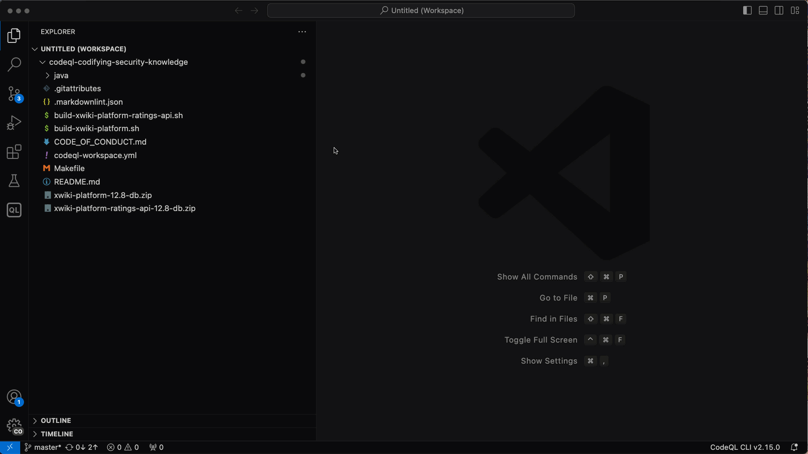
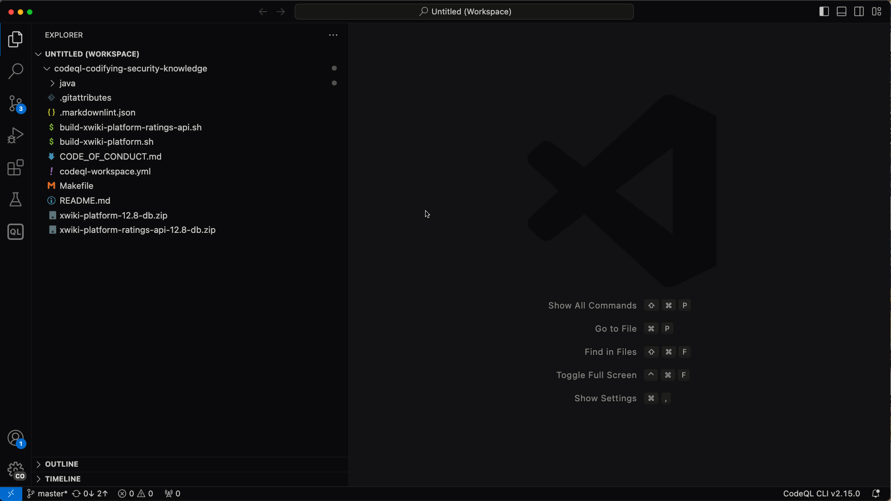

<h1 align="center">Codifying security knowledge</h1>
<h3 align="center">Going from security advisory to CodeQL query</h3>
<h5 align="center">@thezefan, @lcartey, @rvermeulen</h3>

<p align="center">
  <a href="#mega-prerequisites">Prerequisites</a> •
  <a href="#books-resources">Resources</a> •
  <a href="#learning-objectives">Learning Objectives</a>
</p>

- **Who is this for**: Security Engineers, Security Researchers, Developers.
- **What you'll learn**: Learn how to use CodeQL for code exploration and for finding security issues.
- **What you'll build**: Build a CodeQL query based on a security advisory to find a SQL injection.

## Learning Objectives

In this workshop will cover the following learning objectives:

- Understand how to use CodeQL in exploration and identification of security vulnerabilities.
- Be able to codify a security vulnerability as a CodeQL query.
- Be able to refine queries to find variants and increase precision.
- Understand how refined queries can be integrated into the developer workflow to prevent future vulnerabilities.

## :mega: Prerequisites

Before joining the workshop, there are a few items that you will need to install or bring with you.

- Install [Visual Studio Code](https://code.visualstudio.com/).
- Install the [CodeQL extension](https://marketplace.visualstudio.com/items?itemName=github.vscode-codeql).
  <details><summary>Walkthrough</summary>

  

  </details>
- Install the required CodeQL pack dependencies by running the command `CodeQL: Install pack dependencies` to install the dependencies for the pack `githubuniverseworkshop/sql-injection-queries`.
  <details><summary>Walkthrough</summary>

  

  </details>
- Install [git LFS](https://docs.github.com/en/repositories/working-with-files/managing-large-files/installing-git-large-file-storage) to download the prepared databases or build the databases locally using the provide Make file. The Makefile requires the presence of [Docker](https://www.docker.com/).
- Test your setup perform the steps:

  1. Right-click on the file [xwiki-platform-ratings-api-12.8-db.zip](./xwiki-platform-ratings-api-12.8-db.zip) and run the command `CodeQL: Set Current Database`.
  2. Right-click on the file [SqlInjection.ql](./java/sql-injection/src/SqlInjection.ql) and run the command `CodeQL: Run Queries in Selected Files`.
  3. See the result `Hello GitHub Universe!` in the *CodeQL Query Results* pane.

   If you run into issues with your setup feel free to ask for support at the start of the workshop.

   <details><summary>Walkthrough</summary>

   

   </details>

After finishing the technical prerequisites consider the following tutorials/guides for basic understanding of QL and Java query writing:

- [QL tutorials](https://codeql.github.com/docs/writing-codeql-queries/ql-tutorials/)
- [Basic query for Java code](https://codeql.github.com/docs/codeql-language-guides/basic-query-for-java-code/)
- [QL classes](https://codeql.github.com/docs/ql-language-reference/types/#classes)

## :books: Resources

- [QL tutorials](https://codeql.github.com/docs/writing-codeql-queries/ql-tutorials/)
- [CodeQL for Java language guide](https://codeql.github.com/docs/codeql-language-guides/codeql-for-java/)
- [CodeQL documentation](https://codeql.github.com/docs/)
- [SQL injection](https://portswigger.net/web-security/sql-injection)
- [QL language reference](https://codeql.github.com/docs/ql-language-reference/)
- [CodeQL library for Java](https://codeql.github.com/codeql-standard-libraries/java/)

## Workshop

Welcome to the workshop Codifying security knowledge - Going from security advisory to CodeQL query!
In this workshop we will apply CodeQL to gain a better understanding of a security issues reported in a security advisory, codify this new security knowledge, and run it to find a SQL injection issue and other variants.

Before we get started it is important that all of the prerequisites are met so you can participate in the workshop.

The workshop is divided into multiple sections and each section consists of exercises that build up to the final query.
For each section we provide *hints* that help you finish the exercise by providing you with references to QL classes and member predicates that you can use.

### Overview

In this workshop we will look for a known *SQL injection vulnerabilities* in the [XWiki Platform](https://xwiki.org)'s ratings API component. Such vulnerabilities can occur in applications when information that is controlled by a user makes its way to application code that insecurely construct a SQL query and executes it. SQL queries insecurely constructed from user input can be rewritten to perform unintended actions such as the disclosure of sensitive information.

The SQL injection discussed in this workshop is reviewed in [GHSA-79rg-7mv3-jrr5](https://github.com/advisories/GHSA-79rg-7mv3-jrr5) in [GitHub Advisory Database](https://github.com/advisories).

To find the SQL injection we are going to:

- Identify the vulnerable method discussed in the advisory and determine how it is used.
- Model the vulnerable method as a SQL sink so the SQL injection query is aware of this method.
- Identify how the vulnerable method can be used by finding new XWiki specific entrypoints.
- Model the new entrypoints as a source of untrusted data that can be used by CodeQL queries.

Once we have completed the above steps, we can see whether the models, our codified security knowledge, can uncover variants or possible
other security issues.

Let's start with finding more about the SQL injection.

### 1. Finding the insecure method

In the security advisory [GHSA-79rg-7mv3-jrr5](https://github.com/advisories/GHSA-79rg-7mv3-jrr5) in [GitHub Advisory Database](https://github.com/advisories) we learn of a [Jira issue](https://jira.xwiki.org/browse/XWIKI-17662) that discusses SQL injection in more detail.

From the Jira issue we learn that:

1. There exists a method `getAverageRating` in the *Rating Script Service*.
2. The two parameters of `getAverageRating` are used in the class `AbstractRatingManager` to insecurely construct a SQL statement.

We will use CodeQL to find the method and use the results to better understand how the SQL injection can manifest.

Select the database [xwiki-platform-ratings-api-12.8-db.zip] as the current database by right-clicking on it in the *Explorer* and executing the command *CodeQL: Set current database*.

The following steps can be implemented in the exercise file [SqlInjection.ql](./java/sql-injection/src/SqlInjection.ql)

1. Find all the methods with the name `getAverageRating`
   <details>
   <summary>Hints</summary>

   - The `java` module provides a class [Method](https://codeql.github.com/codeql-standard-libraries/java/semmle/code/java/Member.qll/type.Member$Method.html) to reason about methods in a program.
   - The class [Method](https://codeql.github.com/codeql-standard-libraries/java/semmle/code/java/Member.qll/type.Member$Method.html) provides the member predicates [getName](https://codeql.github.com/codeql-standard-libraries/java/semmle/code/java/Element.qll/predicate.Element$Element$getName.0.html) and [hasName](https://codeql.github.com/codeql-standard-libraries/java/semmle/code/java/Element.qll/predicate.Element$Element$hasName.1.html) to reason about the name of a method.

   </details>
2. Refine the set of results by limiting it to methods named `getAverageRating` where the first parameter is named `fromsql`.
   <details>
   <summary>Hints</summary>

   - The class [Method](https://codeql.github.com/codeql-standard-libraries/java/semmle/code/java/Member.qll/type.Member$Method.html)  provides the member predicate [getParameter](https://codeql.github.com/codeql-standard-libraries/java/semmle/code/java/Member.qll/predicate.Member$Callable$getParameter.1.html) that expects an index to retrieve the corresponding parameter, if any.
   - The class [Parameter](https://codeql.github.com/codeql-standard-libraries/java/semmle/code/java/Variable.qll/type.Variable$Parameter.html) provides the member predicates [getName](https://codeql.github.com/codeql-standard-libraries/java/semmle/code/java/Element.qll/predicate.Element$Element$getName.0.html) and [hasName](https://codeql.github.com/codeql-standard-libraries/java/semmle/code/java/Element.qll/predicate.Element$Element$hasName.1.html) to reason about the name of a parameter.

   </details>
3. Find all the methods with the name `getAverageRatingFromQuery`.
   <details>
   <summary>Hints</summary>

   - The `java` module provides a class [Method](https://codeql.github.com/codeql-standard-libraries/java/semmle/code/java/Member.qll/type.Member$Method.html)  to reason about methods in a program.
   - The class [Method](https://codeql.github.com/codeql-standard-libraries/java/semmle/code/java/Member.qll/type.Member$Method.html)  provides the member predicates [getName](https://codeql.github.com/codeql-standard-libraries/java/semmle/code/java/Element.qll/predicate.Element$Element$getName.0.html) and [hasName](https://codeql.github.com/codeql-standard-libraries/java/semmle/code/java/Element.qll/predicate.Element$Element$hasName.1.html) to reason about the name of a method.

   </details>
4. Reduce the number of results by filtering uninteresting results.
   <details>
   <summary>Hints</summary>

   - The class [Method](https://codeql.github.com/codeql-standard-libraries/java/semmle/code/java/Member.qll/type.Member$Method.html)  provides the member predicates [getBody](https://codeql.github.com/codeql-standard-libraries/java/semmle/code/java/Member.qll/predicate.Member$Callable$getBody.0.html) to reason about the statements that constitute a method.
   - You can use the quantifier [exists](https://codeql.github.com/docs/ql-language-reference/formulas/#exists) like `not exists(foo())` to determine if a predicate has no results.

   </details>
5. Find all the calls to a method named `search`.
   <details>
   <summary>Hints</summary>

   - Calls to methods are method accesses. The class [MethodAccess](https://codeql.github.com/codeql-standard-libraries/java/semmle/code/java/Expr.qll/type.Expr$MethodAccess.html) allows you to reason about method accesses.
   - The class [MethodAccess](https://codeql.github.com/codeql-standard-libraries/java/semmle/code/java/Expr.qll/type.Expr$MethodAccess.html) provides a member predicate [getMethod](https://codeql.github.com/codeql-standard-libraries/java/semmle/code/java/Expr.qll/predicate.Expr$MethodAccess$getMethod.0.html) allows you to reason about the method being accessed.
   - The class [MethodAccess](https://codeql.github.com/codeql-standard-libraries/java/semmle/code/java/Expr.qll/type.Expr$MethodAccess.html) provides the member predicates [getName](https://codeql.github.com/codeql-standard-libraries/java/semmle/code/java/Element.qll/predicate.Element$Element$getName.0.html) and [hasName](https://codeql.github.com/codeql-standard-libraries/java/semmle/code/java/Element.qll/predicate.Element$Element$hasName.1.html) to reason about the name of a method.

   </details>
6. Find all the method accesses in the method `getAverageRatingFromQuery`.
   <details>
   <summary>Hints</summary>

   - The class [MethodAccess](https://codeql.github.com/codeql-standard-libraries/java/semmle/code/java/Expr.qll/type.Expr$MethodAccess.html) provides the member predicate [getEnclosingCallable](https://codeql.github.com/codeql-standard-libraries/java/semmle/code/java/Expr.qll/predicate.Expr$MethodAccess$getEnclosingCallable.0.html) to reason about the method or constructor containing the method access.
   - The class [Callable](https://codeql.github.com/codeql-standard-libraries/java/semmle/code/java/Member.qll/type.Member$Callable.html) provides the member predicates [getName](https://codeql.github.com/codeql-standard-libraries/java/semmle/code/java/Element.qll/predicate.Element$Element$getName.0.html) and [hasName](https://codeql.github.com/codeql-standard-libraries/java/semmle/code/java/Element.qll/predicate.Element$Element$hasName.1.html) to reason about the name of a method.

   </details>
7. Select the qualified name of the method `search`.
   <details>
   <summary>Hints</summary>

   - The class [Method](https://codeql.github.com/codeql-standard-libraries/java/semmle/code/java/Member.qll/type.Member$Method.html) provides the member predicate [getQualifiedName](https://codeql.github.com/codeql-standard-libraries/java/semmle/code/java/Member.qll/predicate.Member$Member$getQualifiedName.0.html) useful fore debugging. The more efficient [hasQualifiedName](https://codeql.github.com/codeql-standard-libraries/java/semmle/code/java/Member.qll/predicate.Member$Member$hasQualifiedName.3.html) for restricting a method.
   </details>
8. Use the qualified name of the method `search` to uniquely identify it.
   <details>
   <summary>Hints</summary>

   - Use the [where](https://codeql.github.com/docs/ql-language-reference/queries/#select-clauses) clause to restrict the results of the query.
   - The class [Method](https://codeql.github.com/codeql-standard-libraries/java/semmle/code/java/Member.qll/type.Member$Method.html) provides the member predicate [getQualifiedName](https://codeql.github.com/codeql-standard-libraries/java/semmle/code/java/Member.qll/predicate.Member$Member$getQualifiedName.0.html) useful fore debugging. The more efficient [hasQualifiedName](https://codeql.github.com/codeql-standard-libraries/java/semmle/code/java/Member.qll/predicate.Member$Member$hasQualifiedName.3.html) for restricting a method.

   </details>

### 2. Modelling a SQL sink

The following steps can be implemented in the exercise file [SqlInjection.ql](./java/sql-injection/src/SqlInjection.ql)
You can use [CheckPoint1.ql](./java/sql-injection/src/checkpoints/CheckPoint1.ql) as a starting point if you were unable to complete the previous section.

1. Find the first argument of all the method calls to `search` method.
   <details>
   <summary>Hints</summary>

   - The class [MethodAccess](https://codeql.github.com/codeql-standard-libraries/java/semmle/code/java/Expr.qll/type.Expr$MethodAccess.html) provides a member predicate [getMethod](https://codeql.github.com/codeql-standard-libraries/java/semmle/code/java/Expr.qll/predicate.Expr$MethodAccess$getMethod.0.html) allows you to reason about the method being accessed.
   - The class [MethodAccess](https://codeql.github.com/codeql-standard-libraries/java/semmle/code/java/Expr.qll/type.Expr$MethodAccess.html) provides the member predicate [getArgument](https://codeql.github.com/codeql-standard-libraries/java/semmle/code/java/Expr.qll/predicate.Expr$MethodAccess$getArgument.1.html) and [getAnArgument](https://codeql.github.com/codeql-standard-libraries/java/semmle/code/java/Expr.qll/predicate.Expr$MethodAccess$getAnArgument.0.html) to reason about arguments used by the method call.

   <details>

To inform the data flow analysis of our new sink we must extend the class [QueryInjectionSink](https://codeql.github.com/codeql-standard-libraries/java/semmle/code/java/security/QueryInjection.qll/type.QueryInjection$QueryInjectionSink.html) with the logic of our [select clause](https://codeql.github.com/docs/ql-language-reference/queries/#select-clauses)

Replace your [select clause](https://codeql.github.com/docs/ql-language-reference/queries/#select-clauses) with the following query:

```ql
// Import the SQL injection data flow configuration and extensions points.
import semmle.code.java.security.SqlInjectionQuery

class XWikiSearchSqlInjectionSink extends QueryInjectionSink {
    XWikiSearchSqlInjectionSink() {
      exists(Method searchMethod, MethodAccess searchMethodInvocation, Expr firstArg |
        searchMethod.hasQualifiedName("com.xpn.xwiki.store", "XWikiStoreInterface", "search") and
        searchMethod = searchMethodInvocation.getMethod() and
        searchMethodInvocation.getArgument(0) = firstArg
      |
        firstArg = this.asExpr()
      )
    }
}

from QueryInjectionSink sink
select sink
```

### 3 Attack surface and sources

The following steps can be implemented in the exercise file [SqlInjection.ql](./java/sql-injection/src/SqlInjection.ql)
You can use [CheckPoint2.ql](./java/sql-injection/src/checkpoints/CheckPoint2.ql) as a starting point if you were unable to complete the previous section.

1. Write a query that finds classes annotated with `org.xwiki.component.annotation.Component`.
   <details>
   <summary>Hints</summary>

   - The class [Class](https://codeql.github.com/codeql-standard-libraries/java/semmle/code/java/Type.qll/type.Type$Class.html) provides the member predicate [hasAnnotation](https://codeql.github.com/codeql-standard-libraries/java/semmle/code/java/Annotation.qll/predicate.Annotation$Annotatable$hasAnnotation.0.html) to determine if the class is annotated.

   </details>
2. Extend the query to include only classes that implement the interface `org.xwiki.script.service.ScriptService`.
   <details>
   <summary>Hints</summary>

   - The class [Interface](https://codeql.github.com/codeql-standard-libraries/java/semmle/code/java/Type.qll/type.Type$Interface.html) represents all the Java interfaces in a program.
   - The class [Interface](https://codeql.github.com/codeql-standard-libraries/java/semmle/code/java/Type.qll/type.Type$Interface.html) provides the member predicates [getQualifiedName](https://codeql.github.com/codeql-standard-libraries/java/semmle/code/java/Type.qll/predicate.Type$RefType$getQualifiedName.0.html) and [hasQualifiedName](https://codeql.github.com/codeql-standard-libraries/java/semmle/code/java/Type.qll/predicate.Type$RefType$hasQualifiedName.2.html) to reason about the qualified name of an Java interface.

   </details>
3. Extends the query to find all the parameters of the just found public methods.
   <details>
   <summary>Hints</summary>

   - The class [Class](https://codeql.github.com/codeql-standard-libraries/java/semmle/code/java/Type.qll/type.Type$Class.html) provides the member predicate [getAMethod](https://codeql.github.com/codeql-standard-libraries/java/semmle/code/java/Type.qll/predicate.Type$RefType$getAMethod.0.html) to reason about method declared by a class.
   - The class [Method](https://codeql.github.com/codeql-standard-libraries/java/semmle/code/java/Member.qll/type.Member$Method.html) provides the member predicate [isPublic](https://codeql.github.com/codeql-standard-libraries/java/semmle/code/java/Member.qll/predicate.Member$Method$isPublic.0.html) to determine if a method is publicly accessible.
   - The class [Method](https://codeql.github.com/codeql-standard-libraries/java/semmle/code/java/Member.qll/type.Member$Method.html) provides the member predicates [getParameter](https://codeql.github.com/codeql-standard-libraries/java/semmle/code/java/Member.qll/predicate.Member$Callable$getParameter.1.html) and [getAParameter](https://codeql.github.com/codeql-standard-libraries/java/semmle/code/java/Member.qll/predicate.Member$Callable$getAParameter.0.html) to reason about a method's parameters.

   </details>

To inform the data flow analysis of our new source we must extend the class [RemoteFlowSource](https://codeql.github.com/codeql-standard-libraries/java/semmle/code/java/dataflow/FlowSources.qll/type.FlowSources$RemoteFlowSource.html) with the logic of our [select clause](https://codeql.github.com/docs/ql-language-reference/queries/#select-clauses)

1. Replace your [select clause](https://codeql.github.com/docs/ql-language-reference/queries/#select-clauses) with the following query:

   ```ql
   class XWikiScriptableComponentSource extends RemoteFlowSource {
      XWikiScriptableComponentSource() {
         exists(Class component, Interface scriptService, Method publicMethod, Parameter parameter |
            component
                  .getAnAnnotation()
                  .getType()
                  .hasQualifiedName("org.xwiki.component.annotation", "Component") and
            scriptService.hasQualifiedName("org.xwiki.script.service", "ScriptService") and
            component.extendsOrImplements(scriptService) and
            component.getAMethod() = publicMethod and
            publicMethod.isPublic() and
            publicMethod.getAParameter() = parameter
            |
            this.asParameter() = parameter
         )
      }

      override string getSourceType() { result = "XWiki scriptable component" }
   }

   import QueryInjectionFlow::PathGraph

   from QueryInjectionFlow::PathNode source, QueryInjectionFlow::PathNode sink
   where QueryInjectionFlow::flowPath(source, sink)
   select sink, source, sink, "Found SQL injection from $@", source, "source"
   ```

2. Add the following meta data to the top of your query (above the `import java`) to inform the CodeQL Result Viewer to display paths.

   ```ql
   /**
   * @kind path-problem
   */
   ```

3. Run you query.

With the final query we can commence with variant analysis.
You can use [CheckPoint3.ql](./java/sql-injection/src/checkpoints/CheckPoint3.ql) as a starting point if you were unable to complete this section.
